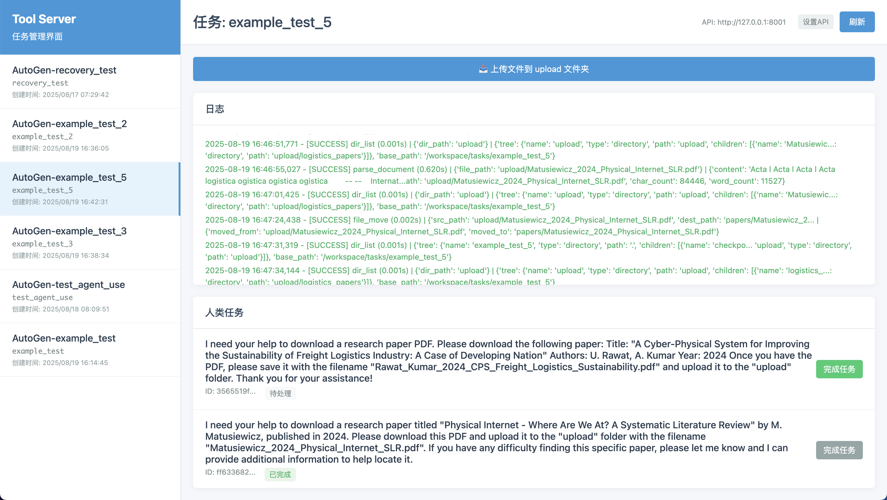

# Multi-Level Agent Framework / 多级代理框架

<div align="center">


**A Multi-Level Task Decomposition Framework for Autonomous AI Agents**

**多级任务分解框架，实现自主AI代理**

[English](#english) | [中文](#chinese)

</div>

---

## English

### 🚀 Framework Overview

We propose a novel framework, **Multi-Level-Agent**, built on the central idea of **"dynamically decomposing complex tasks into the simplest possible sub-tasks, each executed by a specialized and powerful intelligent node."** This framework is designed to overcome the limitations of traditional workflows—which lack flexibility—and general-purpose agents, which often suffer from long, unpredictable, and hard-to-control invocation chains.

### 🏗️ Key Architectural Features

#### 1. **Standardized Node Abstraction**
- Agents and tools are uniformly abstracted as "nodes"
- Each intelligent node is only allowed to invoke a limited number of lower-level nodes
- Ensures that every node remains narrowly focused and highly specialized

#### 2. **Multi-Level Task Decomposition Architecture**
- Any complex task is decomposed into a large number of focused, fine-grained sub-tasks
- Each sub-task is handled by a specialized node
- The majority of lightweight task nodes can run using small models

#### 3. **Lightweight Node Communication**
- Nodes communicate only by passing data keys or file addresses
- No content transmission, significantly reducing communication overhead
- All intermediate and final outputs are stored in a shared task-specific workspace
- All related nodes can access data on demand

#### 4. **Built-in Reflection and Planning Mechanisms**
- Each base-level agent node integrates two components: **thinking** and **judging**
- **Thinking module**: Monitors task progress and triggers re-planning at fixed execution intervals
- **Judging module**: Reflects on intermediate outputs to ensure stability and quality

### 🎯 Current Implementation: Multi-Level Agent System

This repository showcases a comprehensive **Multi-Level Agent System** with the following capabilities:

#### 🔧 **Core Agent Framework** (v1.0-1.2)
- **Minimal Human Intervention**: Generate complete academic papers with minimal human input
- **No Ideas Required**: No need to provide research ideas or topics
- **No References Required**: No need to provide reference codes or literature
- **Simple Input**: Just tell the agent "Help me write a paper about XXX"
- **Complete Automation**: From literature search to final PDF generation

#### 🚀 **New in v1.3: Advanced Features**
- **🌐 REST API Interface**: Complete API server with task management, pause/resume capabilities
- **🧠 Agent Long-term Memory**: Persistent conversation history and intelligent message compression
- **⏸️ User Interruption & Resume**: Real-time task pause/resume with SIGINT signal handling
- **🎛️ Agent System Customization**: Upload custom agent configurations via ZIP packages
- **🐳 Docker Support**: Containerized deployment with secure configuration management
- **📊 Hierarchical Task Tracking**: Real-time agent call stack and progress monitoring

### 📈 Scalability & Extensibility

The framework supports both **horizontal** and **vertical** scaling:

- **Horizontal Scaling**: Add more agents at the same level for specialized tasks
- **Vertical Scaling**: Add more levels to the hierarchy for complex task decomposition
- **Universal Intelligence**: Scale to general-purpose AGI by adding massive numbers of specialized agents

### 🏆 Advantages Over Traditional Approaches

| Traditional Workflows | General-Purpose Agents | **Multi-Level Agent** |
|----------------------|------------------------|----------------------|
| ❌ Rigid, inflexible | ❌ Long, unpredictable chains | ✅ **Flexible & Predictable** |
| ❌ Hard to maintain | ❌ Hard to control | ✅ **Easy to Control** |
| ❌ Limited scalability | ❌ Quality degradation | ✅ **Highly Scalable** |
| ❌ Manual task breakdown | ❌ Context overflow | ✅ **Automatic Decomposition** |

### 📊 Sample Results / 示例结果

Our Multi-Level Agent has successfully generated the following academic papers:

Only One input:我想要写一篇关于cyber-physical Internet的物流问题的论文，现在时间是:2025年的八月

Output: main.pdf in result fold

我们的多级代理成功生成了以下学术论文：


#### AI_Researcher_output
- **File**: `AI_Researcher_output.pdf`
- **Description**: Generated academic paper / 生成的学术论文
- **Status**: ✅ Complete / 完成


#### main
- **File**: `main.pdf`
- **Description**: Generated academic paper / 生成的学术论文
- **Status**: ✅ Complete / 完成


#### Robustness
- **File**: `Robustness.pdf`
- **Description**: Generated academic paper / 生成的学术论文
- **Status**: ✅ Complete / 完成


#### Optimizer_V1
- **File**: `Optimizer_V1.pdf`
- **Description**: Generated academic paper / 生成的学术论文
- **Status**: ✅ Complete / 完成


> **Note**: PDF files cannot be displayed directly in GitHub README. To view the results:
> 1. Clone the repository / 克隆仓库
> 2. Navigate to the `results/` folder / 导航到 `results/` 文件夹
> 3. Open the PDF files with your preferred viewer / 用您喜欢的查看器打开PDF文件
>
> **注意**：PDF文件无法直接在GitHub README中显示。要查看结果：
> 1. 克隆仓库
> 2. 导航到 `results/` 文件夹  
> 3. 用您喜欢的查看器打开PDF文件
---

## Chinese

### 🚀 框架概述

我们提出了一个全新的框架——**多级代理（Multi-Level-Agent）**，其核心理念是**"动态将复杂任务分解为尽可能简单的子任务，每个子任务由专门化的强大智能节点执行"**。该框架旨在克服传统工作流缺乏灵活性的局限性，以及通用代理常常面临的调用链冗长、不可预测且难以控制的问题。

### 🏗️ 核心架构特性

#### 1. **标准化节点抽象**
- 代理和工具统一抽象为"节点"
- 每个智能节点只允许调用有限数量的下级节点
- 确保每个节点保持专注且高度专业化

#### 2. **多级任务分解架构**
- 任何复杂任务都被分解为大量专注的细粒度子任务
- 每个子任务由专门的节点处理
- 大部分轻量级任务节点可以使用小模型运行

#### 3. **轻量级节点通信**
- 节点间仅通过传递数据键或文件地址进行通信
- 不传输内容本身，显著减少通信开销
- 所有中间和最终输出存储在共享的任务特定工作空间中
- 所有相关节点可按需访问数据

#### 4. **内置反思和规划机制**
- 每个基础级代理节点集成两个组件：**思考**和**判断**
- **思考模块**：监控任务进度，在固定执行间隔触发重新规划
- **判断模块**：对中间输出进行反思，确保稳定性和质量

### 🎯 当前实现：多级代理系统

本仓库展示了一个完整的**多级代理系统**，具备以下能力：

#### 🔧 **核心代理框架** (v1.0-1.2)
- **最少人工干预**：以最少的人工输入生成完整的学术论文
- **无需提供想法**：无需提供研究想法或主题
- **无需提供参考**：无需提供参考代码和参考文献
- **简单输入**：只需告诉代理"帮我写一篇关于XXX的论文"
- **完全自动化**：从文献搜索到最终PDF生成

#### 🚀 **v1.3新功能**
- **🌐 REST API接口**：完整的API服务器，支持任务管理和暂停/恢复功能
- **🧠 Agent长期记忆**：持久化对话历史和智能消息压缩
- **⏸️ 用户中断与恢复**：实时任务暂停/恢复，支持SIGINT信号处理
- **🎛️ Agent系统定制化**：通过ZIP包上传自定义Agent配置
- **🐳 Docker支持**：容器化部署和安全配置管理
- **📊 层级任务跟踪**：实时Agent调用栈和进度监控

### 📈 可扩展性

该框架支持**横向**和**纵向**扩展：

- **横向扩展**：在同一层级添加更多专门化任务的代理
- **纵向扩展**：增加层级深度以处理复杂任务分解
- **通用智能**：通过添加大量专门化代理实现通用人工智能

### 🏆 相比传统方法的优势

| 传统工作流 | 通用代理 | **多级代理** |
|----------|---------|------------|
| ❌ 刚性，不灵活 | ❌ 调用链长且不可预测 | ✅ **灵活且可预测** |
| ❌ 难以维护 | ❌ 难以控制 | ✅ **易于控制** |
| ❌ 扩展性有限 | ❌ 质量下降 | ✅ **高度可扩展** |
| ❌ 手动任务分解 | ❌ 上下文溢出 | ✅ **自动分解** |

### 📊 示例结果
唯一输入（人类干预）:我想要写一篇关于cyber-physical Internet的物流问题的论文，现在时间是:2025年的八月

端到端全流程（pdf文献下载除外，智能体会为你找到文献，但是需要使用自己的机构账号下载文献）: main.pdf in result fold

查看 `/results` 文件夹中的示例输出：
- `AI_Researcher_output.pdf` - AI研究论文
- `main.pdf` - 具有完整结构的学术论文
- `Optimizer_V1.pdf` - 技术优化论文
- `Robustness.pdf` - 系统鲁棒性分析

---

## 🛠️ Installation & Setup / 安装与设置

### Prerequisites / 前置要求

- **Docker**: Required for Tool Server / Docker必需用于工具服务器
- **Python 3.8+**: For running the Multi-Level Agent / 用于运行多级代理
- **API Keys**: Claude API recommended (OpenAI, Gemini also supported) / 推荐Claude API（也支持OpenAI、Gemini）

### Tool Server / 工具服务器

This project is built on [**Tool Server**](https://github.com/ChenglinPoly/toolServer) - a powerful multi-functional tool server that provides:

本项目基于 [**工具服务器**](https://github.com/ChenglinPoly/toolServer) - 一个强大的多功能工具服务器，提供：

- File operations / 文件操作
- Code execution / 代码执行
- Web scraping / 网页抓取
- Document processing / 文档处理
- Version control / 版本控制
- LaTeX compilation / LaTeX编译
- And much more... / 以及更多功能...

### Quick Start / 快速开始

1. **Clone the repository / 克隆仓库**
   ```bash
   git clone <your-repo-url>
   cd Multi-Level-Agent
   ```

2. **Configure LLM API / 配置LLM API**
   
   Edit `config/run_env_config/llm_config.yaml` and add your API keys:
   
   编辑 `config/run_env_config/llm_config.yaml` 并添加您的API密钥：

   ```yaml
   # Recommended: Claude API / 推荐：Claude API
   claude:
     official:
       api_key: "your-claude-api-key"  # Your Claude API key / 您的Claude API密钥
   
   # Alternative: OpenAI API / 备选：OpenAI API
   openai:
     official:
       api_key: "your-openai-api-key"  # Your OpenAI API key / 您的OpenAI API密钥
   ```

3. **Run the startup script / 运行启动脚本**
   
   **Linux/macOS:**
   ```bash
   ./start_simple.sh
   ```
   
   **Windows:**
   ```cmd
   start_simple.bat
   ```

4. **Follow the prompts / 按照提示操作**
   - Choose to pull Docker image or use local / 选择拉取Docker镜像或使用本地
   - Enter your writing requirement / 输入您的写作需求
   - Enter a task ID / 输入任务ID
   - Wait for the agent to complete the task / 等待代理完成任务

### Configuration / 配置

#### LLM Configuration / LLM配置

The project **defaults to Claude models** for optimal performance. You can modify `config/run_env_config/llm_config.yaml`:

项目**默认使用Claude模型**以获得最佳性能。您可以修改 `config/run_env_config/llm_config.yaml`：

```yaml
# Default settings / 默认设置
default:
  force_tool_calling: true
  temperature: 0
  max_tokens: 0

# Claude (Recommended) / Claude（推荐）
claude:
  official:
    api_key: "your-api-key"
    models:
      - "claude-3-5-sonnet-20241022"
      - "claude-3-5-haiku-20241022"
      - "claude-3-7-sonnet-20250219"

# OpenAI (Alternative) / OpenAI（备选）
openai:
  official:
    api_key: "your-api-key"
    models:
      - "gpt-4o"
      - "gpt-4o-mini"
```

#### Agent Configuration / 代理配置

You can customize agent models by editing files in `config/agent_configs/`:

您可以通过编辑 `config/agent_configs/` 中的文件来自定义代理模型：

- `level_-1_judge_agent.yaml` - Judge agent configuration / 判断代理配置
- `level_0_tools.yaml` - Tool configurations / 工具配置
- `level_1_agents.yaml` - Level 1 agent configurations / 1级代理配置
- `level_2_agents.yaml` - Level 2 agent configurations / 2级代理配置
- `level_3_agents.yaml` - Level 3 agent configurations / 3级代理配置

**Note**: While you can change models, **Claude is strongly recommended** for best results.

**注意**：虽然您可以更改模型，但**强烈推荐使用Claude**以获得最佳结果。

---

## 🎮 Usage / 使用方法

### Basic Usage / 基本使用

1. **Start the system / 启动系统**
   ```bash
   ./start_simple.sh  # Linux/macOS
   start_simple.bat   # Windows
   ```

2. **Enter your requirement / 输入您的需求**
   ```
   Example: "I want to write a paper about cyber-physical Internet logistics problems"
   示例："我想要写一篇关于cyber-physical Internet的物流问题的论文"
   ```

3. **Provide a task ID / 提供任务ID**
   ```
   Example: "logistics_paper_2025"
   示例："logistics_paper_2025"
   ```

4. **Monitor progress / 监控进度**
   - The agent will automatically decompose the task / 代理将自动分解任务
   - Progress will be displayed in real-time / 进度将实时显示
   - Final PDF will be generated in the results folder / 最终PDF将在results文件夹中生成

### Human-in-the-Loop Tasks / 人机协作任务

Sometimes the agent may require human intervention, especially for tasks like downloading copyrighted papers:

有时代理可能需要人工干预，特别是对于下载版权论文等任务：



When you see a human task notification:

当您看到人工任务通知时：

1. **Read the task description carefully / 仔细阅读任务描述**
2. **Complete the requested action / 完成请求的操作**
3. **Upload the required files / 上传所需文件**
4. **Click "Complete Task" / 点击"完成任务"**
5. **The agent will continue automatically / 代理将自动继续**

### Frontend Interface / 前端界面

You can also use the web interface for better task management:

您也可以使用网页界面进行更好的任务管理：

1. **Open the frontend / 打开前端界面**
   ```
   Double-click: frontend/index.html
   双击：frontend/index.html
   ```

2. **Features available / 可用功能**
   - View all tasks / 查看所有任务
   - Upload files / 上传文件
   - Monitor logs / 监控日志
   - Manage human tasks / 管理人工任务

---

## 📁 Project Structure / 项目结构

```
MedProcess/
├── start_simple.sh           # Linux startup script / Linux启动脚本
├── start_simple.bat          # Windows startup script / Windows启动脚本
├── start.py                  # Main agent runner / 主代理运行器
├── config/                   # Configuration files / 配置文件
│   ├── agent_configs/        # Agent configurations / 代理配置
│   └── run_env_config/       # Environment configurations / 环境配置
├── baseService/              # Core agent services / 核心代理服务
├── frontend/                 # Web interface / 网页界面
├── results/                  # Generated outputs / 生成的输出
├── conversations/            # Task conversations / 任务对话记录
├── logs/                     # System logs / 系统日志
└── workspace/                # Docker shared workspace / Docker共享工作空间
```

---

## 🔧 Advanced Configuration / 高级配置

### Custom Models / 自定义模型

To use custom API endpoints or models:

要使用自定义API端点或模型：

```yaml
# In llm_config.yaml
claude:
  custom:
    api_key: "your-custom-key"
    base_url: "your-custom-endpoint"
    models: ["your-custom-model"]
```

### Environment Variables / 环境变量

You can also use environment variables:

您也可以使用环境变量：

```bash
export ANTHROPIC_API_KEY="your-claude-key"
export OPENAI_API_KEY="your-openai-key"
export GEMINI_API_KEY="your-gemini-key"
```

### Docker Options / Docker选项

The startup script supports:

启动脚本支持：

- **Pull latest image / 拉取最新镜像**: Automatically downloads the latest Tool Server
- **Use local image / 使用本地镜像**: Use your own Docker setup
- **Custom directory / 自定义目录**: Specify workspace location

---

## 🤝 Contributing / 贡献

We welcome contributions to expand the Multi-Level Agent framework:

我们欢迎为多级代理框架做出贡献：

1. **Add new agents / 添加新代理**: Create specialized agents for different domains
2. **Extend tools / 扩展工具**: Add new capabilities to the Tool Server
3. **Improve configurations / 改进配置**: Optimize agent parameters
4. **Documentation / 文档**: Help improve documentation and examples

---

## 📄 License / 许可证

This project is licensed under the Apache License 2.0 - see the [LICENSE](LICENSE) file for details.

本项目采用Apache 2.0许可证 - 详细信息请参阅 [LICENSE](LICENSE) 文件。

### Why Apache 2.0? / 为什么选择Apache 2.0？

- **Patent Protection** / **专利保护**: Provides explicit patent grants and protection
- **Attribution Required** / **需要署名**: Requires proper attribution in derivative works  
- **Commercial Friendly** / **商业友好**: Allows commercial use while maintaining protections
- **Industry Standard** / **行业标准**: Widely adopted by major tech companies and projects

---

## 🙏 Acknowledgments / 致谢

- [Tool Server](https://github.com/ChenglinPoly/toolServer) from ChenglinPoly- The powerful backend that makes this framework possible
- Claude AI - For providing excellent language model capabilities
- The open-source community - For continuous inspiration and support

---

<div align="center">

**🌟 If this project helps you, please give it a star! 🌟**

**🌟 如果这个项目对您有帮助，请给个星标！🌟**

Made with ❤️ by the ChenglinPoly

</div> 
